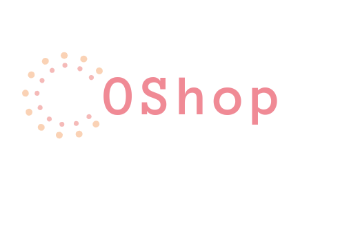
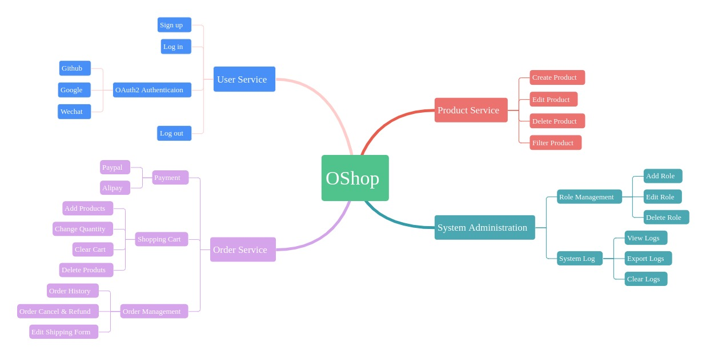
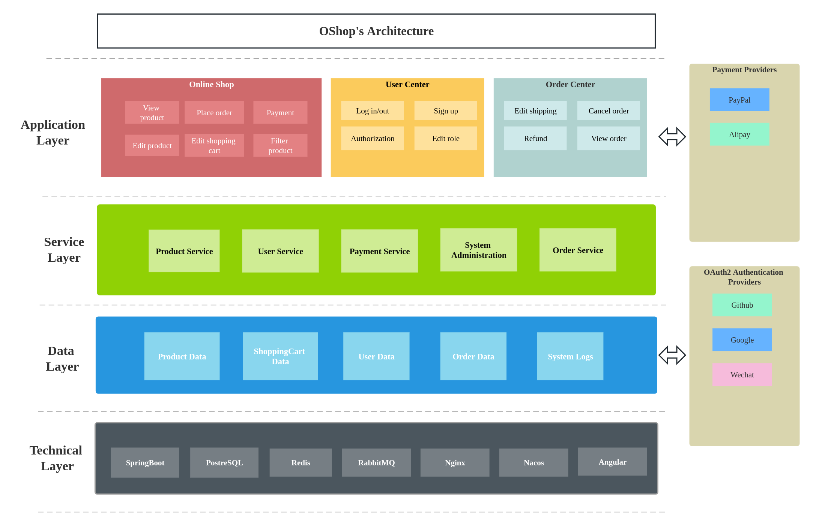
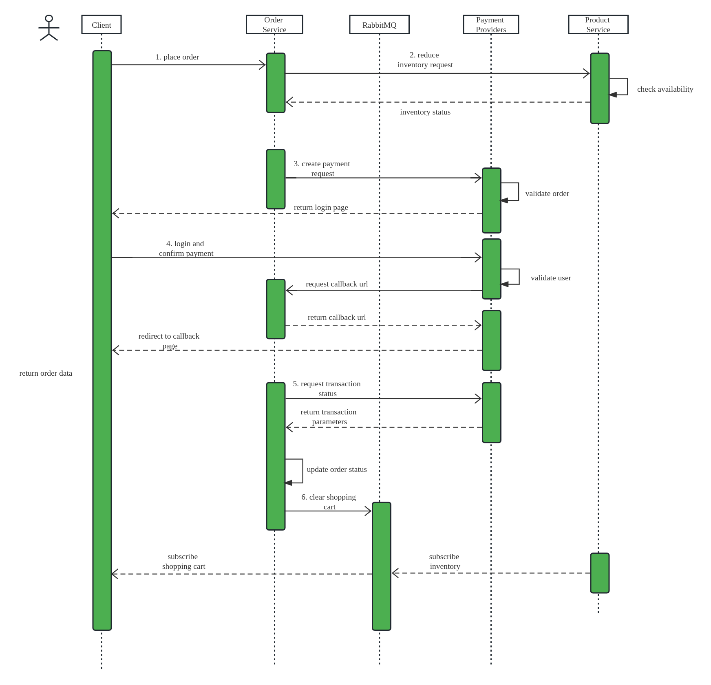
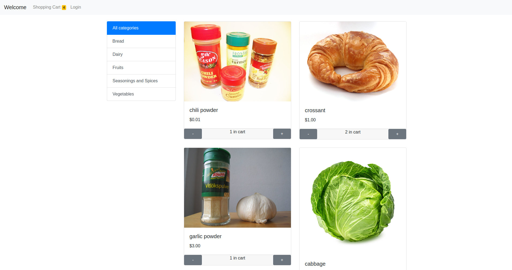
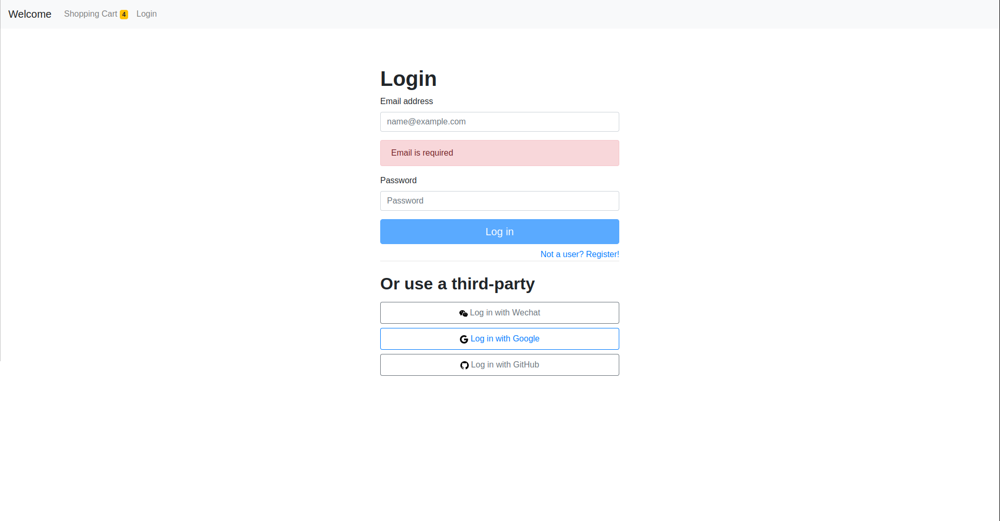
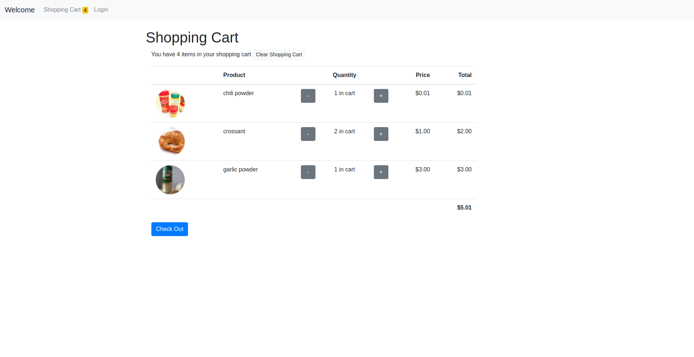
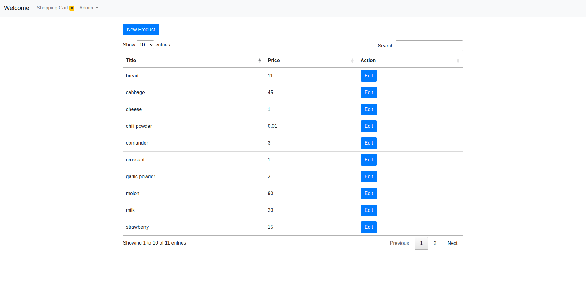
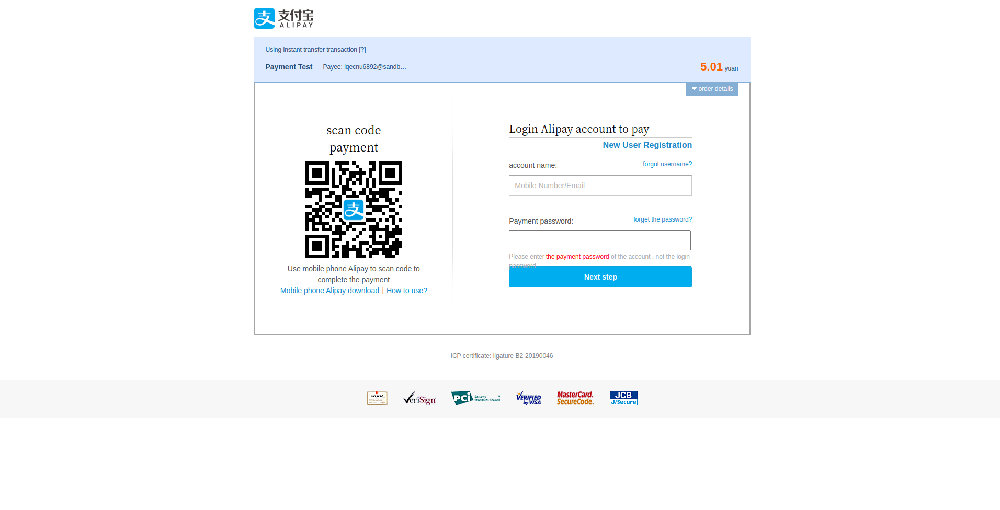

# OShop

	

	<strong>A B2C sales platform designed for enterprises and customers</strong>

	
  	
    

## Table of Contents

- [Introduction](#introduction)
- [Features](#features)
- [System Architecture](#system-architecture)
- [Front-end](#front-end)

## Introduction
OShop is an online shopping website which covers full business processes of online sales, it provides a user-friendly portal for customers to explore products, add desired products to shopping cart, and place orders. What's more, it also acts as a management system for merchants to publish products, handle customers' orders as well as manage permission.

OShop project leverages `Spring Boot` as back-end and `Angular` framework as front-end. In order to handle high volume customer visits, OShop is developed based on distributed Microservice architecture to make sure high availability and high scalability, `Spring Cloud` framework is used to boost and ease microservice-based software development.

## Features

* Integratd `Alipay` and `PayPal` payment interface; support RSA & RSA2 Signature to guarantee secure payment
* Used `Spring Security` to achieve authoirzation and authentication mechanism, data endpoints is only accessible to authorized users
* Integrated OAuth2 authentication providers(Google, Github, Wechat)
* Use `Spring Data` JPA framework to persist data
* RESTful API endpoints
* Products filtering function
* Ease of use product management system
* Use `RabbitMQ` to send inventory information to shopping cart in real-time, making sure that data consistency
* Separation of frond-end and back-end, ensuring the high availability
* Use micro service architecture, functional modules are divided and can be deployed in different docker containers
* Implement Single Sign On (SSO) mechanism, allowing users to login once, then access all modules
* Use JSON Web Token(`JWT`) to identify users' roles and permissions

## System Architecture
> Functional Components

> Application Architecture

> Workflow

> Technology Stack

|Component|Description|Version
|---|---|---
|JDK|Java environment| 11
|SpringBoot|Backend framework|2.3.11.RELEASE
|SpringCloud Alibaba|Microservice development framework|2.2.6.RELEASE
|Spring Data|JPA framework|2.3.9.RELEASE
|Swagger|API Documentation|2.7.0
|Redis|NoSQL DB for cache|7.0.11
|PostgreSQL|Database| 12.15
|RabbitMQ|Message Queue middleware|3.11
|Angular|Front-end framework| 15.2.6
|Bootstrap|UI framework|4.6
|Nacos|Service discovery|1.4.2
|OpenFeign|Declarative REST client|2.2.5.RELEASE
|Druid|DB connection pool| 1.2.15

## Front-end
> Repository

Please check <a href="https://github.com/MingyuHuang/oshop_ui_public">https://github.com/MingyuHuang/oshop_ui_public</a>

> Home Page

> Login Page

> Shopping Cart

> Products Management

> Third Party Payment Page

